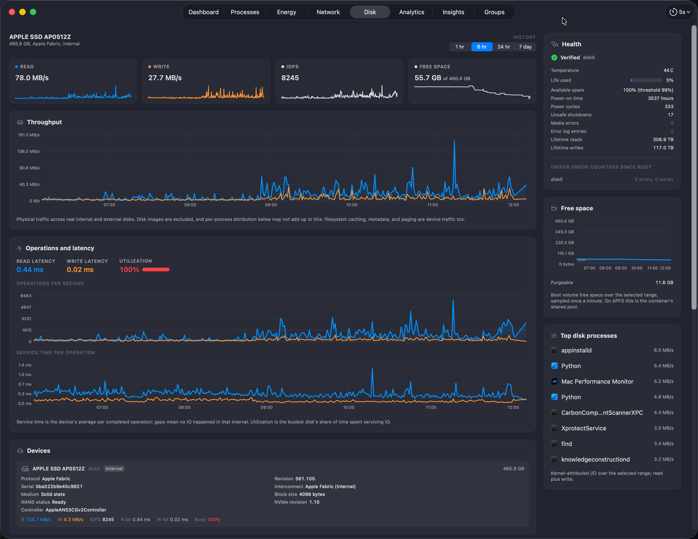
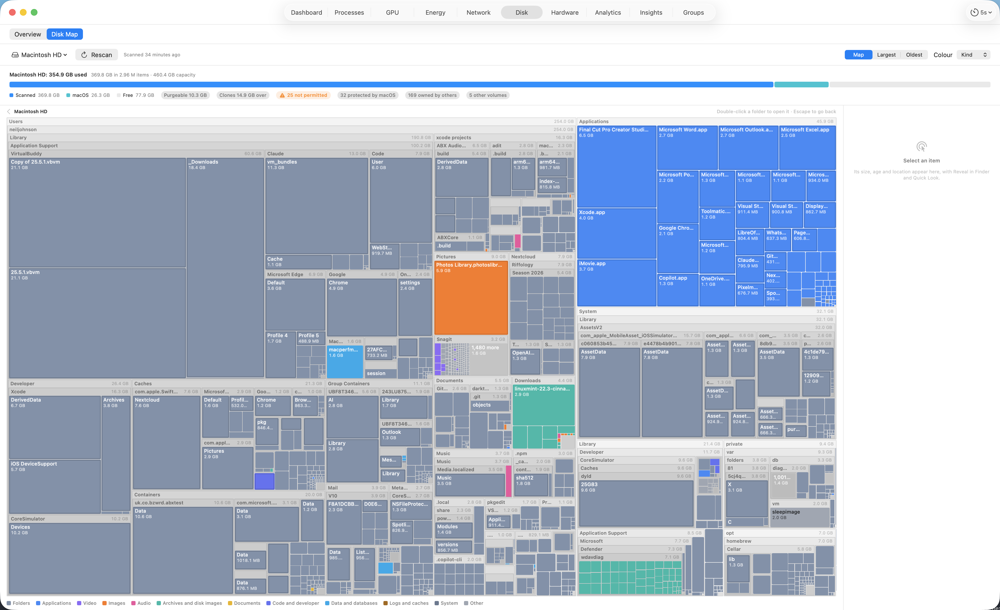
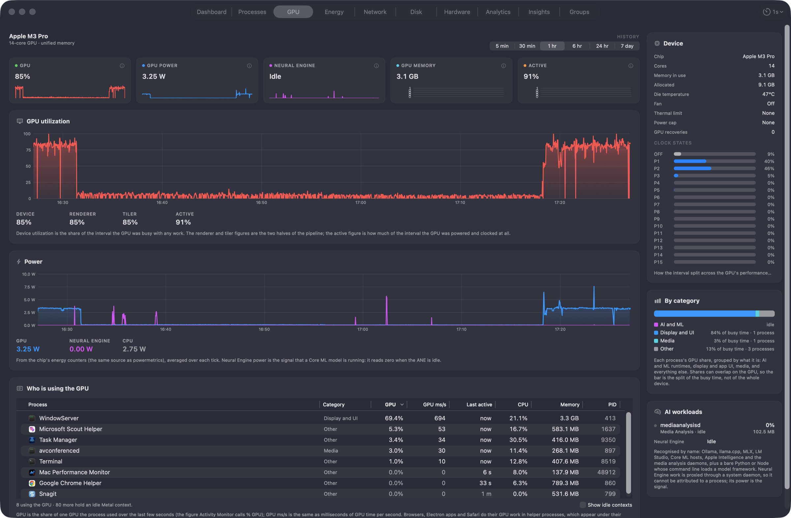
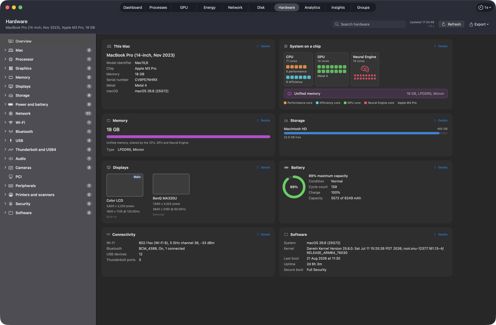

# Mac Performance Monitor

[](https://github.com/Zesty0wl/mac-performance-monitor/actions/workflows/ci.yml)
[](https://github.com/Zesty0wl/mac-performance-monitor/releases/latest)
[](https://github.com/Zesty0wl/mac-performance-monitor/releases)
[](https://formulae.brew.sh/cask/mac-performance-monitor)
[](https://github.com/Zesty0wl/mac-performance-monitor/stargazers)

[](#install)
[](#install)
[](Package.swift)
[](#install)
[](#privacy)
[](https://crowdin.com/project/mac-performance-monitor)
[](LICENSE)

A native macOS **performance analyzer and logger** that lives in your menu bar. It
continuously records CPU, memory pressure, GPU, network, disk, battery, and per-process
usage to a local database, then helps you make sense of it: trends, leaks, pressure
events, and on-device diagnostics.

Free and open source. No telemetry. Every sample stays on your Mac.


## Features

- **Menu bar at a glance:** one compact, configurable item for live memory pressure,
  CPU, GPU, network, disk, and battery readouts, with a shared detail panel.
- **Dashboard:** a plain-language verdict, headline tiles, the pressure timeline
  with selectable ranges, a memory breakdown, and a swap trend.
- **Process explorer:** a live, sortable, filterable table of every process, with a
  detail inspector for footprint, CPU, file descriptors, disk I/O, and Rosetta status
  over time.
- **Process groups:** group related apps and helpers into a stack and see its blended
  footprint as a share of the device.
- **History and logging:** configurable-resolution logging to a local SQLite store;
  top consumers over any window you pick.
- **Disk tab:** live throughput, IOPS, service latency, and utilization with
  history; per-device hardware identity; per-volume capacity bars grouped by
  APFS container with purgeable space; SMART health for the internal SSD; a
  boot-volume free-space trend; and top processes by attributed disk I/O.
- **GPU tab:** who is using the GPU on Apple silicon, per process, with no helper
  (the AGX driver's per-context accounting), plus device utilization, clock-state
  residency, GPU and Neural Engine power, memory, thermal limit and power cap, a
  breakdown by workload category, and recognition of AI runtimes (Ollama, llama.cpp,
  MLX, LM Studio, Core ML, Apple Intelligence) with the model they serve where the
  command line says; an optional sustained-high-GPU alert. The GPU menu bar
  dropdown lists the top GPU processes too.
- **Hardware tab:** this Mac's inventory as a searchable, browsable tree with a
  visual overview: a block diagram of the chip (CPU clusters, GPU cores, Neural
  Engine, unified memory), capacity bars, the displays to scale, battery health,
  and every bus and device `system_profiler` and the kernel report (USB,
  Thunderbolt, Bluetooth, audio, cameras, storage, network, Wi-Fi via CoreWLAN,
  Metal limits, instruction-set features, secure boot). Read on demand with a
  Refresh button, never on the sampling tick; copy any item or save a report.
- **Leak detection:** flags processes whose footprint climbs steadily, plus a log of
  pressure events over time.
- **Deep-dive diagnostics:** explains what a process is and whether its behavior is
  normal, using signed, updatable check packs.
- **Insights and alerts:** quiet-by-default notifications for critical pressure,
  sustained swap, per-process ceilings, and suspected leaks.

## Screenshots

Process explorer, with a per-process detail inspector:


Energy: battery health, an energy-flow view, and the top energy users:


Network throughput and every adapter on the machine:


Disk throughput, service latency, SMART health, free space, and top I/O processes:



Disk Map: scan the startup disk, a volume or any folder and see what is using
the space as a treemap you can zoom into, coloured by kind, age or depth, with
Largest and Oldest views, a bar that reconciles the scan against the volume's
used space (purgeable, clones, folders macOS would not let it read), and Reveal
in Finder and Quick Look on every item. Byte-exact against `du`, a full 3 M-file
disk in about twenty seconds, and the last scan comes back instantly:



GPU: utilization, power, clock states, and who is using the GPU, with AI
workloads picked out:



Hardware: this Mac's inventory, searchable, with the chip drawn core by core:



Analytics: build your own per-process charts over any window:


Insights: what changed, pressure events, and the heaviest consumers:


## Install

Download `MacPerformanceMonitor.pkg` from the [Releases](../../releases) page and
double-click it. It's Developer ID signed and notarized by Apple, so it installs and
launches without security warnings, and keeps itself up to date via Sparkle.

### Homebrew

```sh
brew install --cask mac-performance-monitor
```

This installs the same signed, notarized pkg from the main
[homebrew-cask](https://github.com/Homebrew/homebrew-cask) repository. Homebrew's
bump bot picks up each new release within a few hours, and the app keeps itself
current through Sparkle in between, so `brew upgrade` leaves it alone unless you
pass `--greedy`.

### Build from source

```sh
git clone https://github.com/Zesty0wl/mac-performance-monitor.git
cd mac-performance-monitor
swift build
swift test
Scripts/run.sh
```

Requires macOS 15 (Sequoia) or later and a Swift 6 toolchain (Xcode 16 or a Swift.org
toolchain), on Apple silicon.

## Privacy

No telemetry, no analytics, no phone-home. Every sample is written to a local SQLite
database and never leaves your Mac. Being open source, anyone can audit exactly what
it does.

## Contributing

Contributions are welcome. See [CONTRIBUTING.md](CONTRIBUTING.md) and the
[Code of Conduct](CODE_OF_CONDUCT.md). Security reports go through
[SECURITY.md](SECURITY.md).

Translations are community-contributed: the app ships in English, Simplified
Chinese, and German and French that were generated by Claude Fable 5.1 (an AI
model) and are awaiting review by native speakers. Translate or review in your
browser on
[Crowdin](https://crowdin.com/project/mac-performance-monitor), or edit one file and open a
pull request. See [TRANSLATING.md](TRANSLATING.md).

## License

Released under the [MIT License](LICENSE). Bundles
[GRDB.swift](https://github.com/groue/GRDB.swift) (MIT) and
[Sparkle](https://sparkle-project.org) (MIT).
